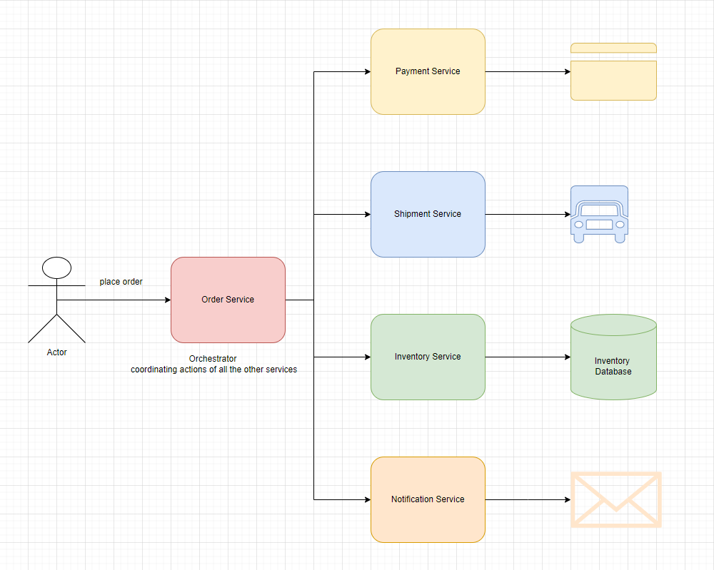
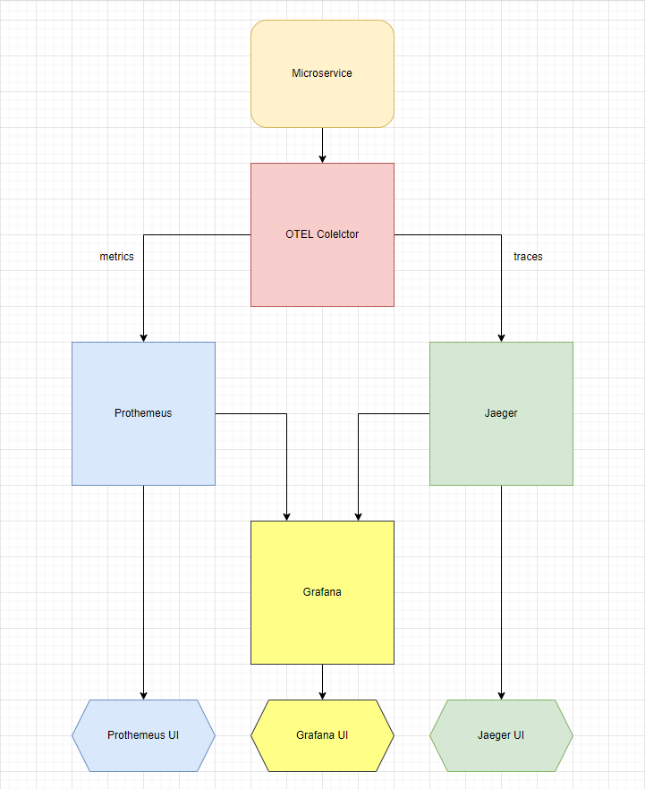
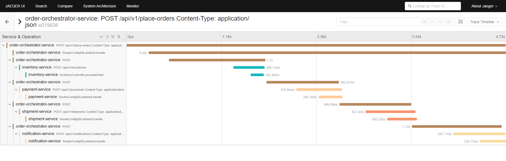

# End To End Tracing

## Overview



## Telemetry Data Flow



## Sample

### End To End Tracing Sample



## Set up

### Open Telemetry Collector

```sh
cd docker

docker run --name otel-collector-development --restart always -p 4317:4317 -v ${PWD}/:/etc/otel-collector/ -d otel/opentelemetry-collector --config=/etc/otel-collector/otel-collector.yaml
```

### Jaeger Tracing

```sh
docker run --name jaeger-development --restart always -p 6831:6831/udp -p 14250:14250 -p 16686:16686 -d jaegertracing/all-in-one
```
